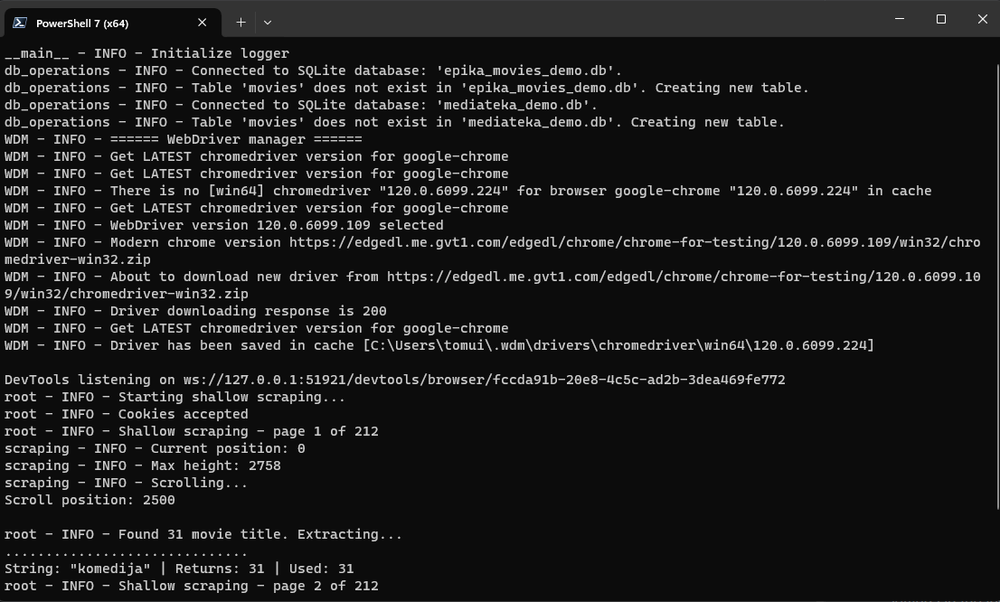

# Media Content Scraper and Database Manager

This application is a personal project designed for learning and improving Python
coding skills. It focuses on scraping two media websites using Selenium, then storing
and managing the scraped data in SQLite databases. The program features a Tkinter-based
GUI, allowing users to interact with and query the databases via SQL requests. Key
learning areas in this project are Selenium for web scraping and SQLite3 for database
management.

## Compliance with Practical Project 1 (PP1) Requirements

### Basic Requirements:

1. **Python Web Scraper:** Developed as a Python web scraping project.
1. **Multiple Websites**: Scrapes two different media websites.
1. **Depth and Breadth in Scraping:** Navigates through multiple pages both ways.
1. **Library/framework for Scraping:** Utilises Selenium.
1. **Structured Project:** Adheres to the recommended Python project structure.
1. **Configuration Files:** Includes 'config.yaml', 'logging.ini', and Python (.py) feature files.
1. **Error Logging:** Centralized error logging to 'error.log' with console streaming.
1. **GitHub Hosting:** Code is hosted on GitHub with multiple commits and branch usage for each ticket.
1. **Comprehensive Documentation:** Includes a detailed README.md and 'requirements.txt' file.

### Optional Requirements (Additional Features):

1. **SQLite3 Database:** Stores scraped data in SQLite3 databases.
1. **GUI:** Incorporates a Tkinter-based GUI.
1. **Argparser**:  Argparser for application demo launch.

## Installation Instructions

Follow these steps to set up the application locally:

1. Ensure you have Python 3.11 installed on your system. You can download it from
[Python's official website](https://www.python.org/downloads/).
1. Download the project from its [GitHub repository](https://github.com/Tomas4python/media_sql)
and extract it into for project created new folder or alternatively if you are GIT user:
   - Open **Command Prompt** or **PowerShell** on your Windows system.
   - Navigate to the project folder using the '**cd**' command. For example:
   ```
   cd path\to\project\folder
   ``` 
   - clone the entire project into project folder by running the script:
   ```
   git clone "https://github.com/Tomas4python/media_sql.git"
   ```
   
1. Optional: Set Up a Virtual Environment:
   - It's recommended to use a virtual environment to avoid conflicts with
   other Python projects or system-wide packages.
   - Open **Command Prompt** or **PowerShell** on your Windows system.
   - Navigate to the project folder using the '**cd**' command. For example:
   ```
   cd path\to\project\folder
   ``` 
   - Create a new virtual environment named 'venv' in the project directory by running the script:

   ```
   python -m venv venv
   ```

   - Activate the virtual environment:

   ```
   .\venv\Scripts\activate
   ```

1. Install Dependencies *(skip navigation if you already are in activated venv according to Step 3)*:
   - Open **Command Prompt** or **PowerShell** on your Windows system.
   - Navigate to the project folder using the '**cd**' command. For example:

   ```
   cd path\to\project\folder
   ```

   - Once in the project folder, execute the following command to install all required dependencies:

   ```
    pip install -r requirements.txt
   ```

   This command will use pip, the Python package installer, to install all the libraries
listed in the requirements.txt file.

By following these steps, you'll have a clean and isolated Python environment for running
and testing this project.

## Launching the Application

### Standard Launch:

Navigate to the project folder and activate venv if created (Step 3 of 'Installation Instructions'). 
Run the application by executing:
```
python main.py
```
If launched this way application will fully scrape the pages and create extensive databases (long runtime).

### Demo Mode (Recommended for Quick Demonstration):

For a quicker demo with limited scraping and temporary databases, use:
```
python main.py demo
```

### Custom Search in Demo Mode:

Use custom search strings for various scraping choices (adds more results to demo databases) :
```
python main.py demo '["string1", "string2", "string3"]'
```

### Show Browser:

To see the scraping process in a browser:
```
python main.py -b
```
or
```
python main.py demo -b
```

## Usage
The application is driven by a Tkinter GUI which consists of three main parts:

### 1. Menu for Scraping Commands:  
- **Shallow Scrape Epika/Mediateka:** Scrapes a list of movies from the first or search page and
saves it to a temporary CSV file (**temp/** directory).
- **Deep Scrape Epika/Mediateka:** Uses the CSV file to scrape detailed information from individual
movie pages and stores it in a SQLite3 database. The CSV file is removed after successful deep scrape.
- *Note:* Shallow and deep scrapes shall be performed independently. Deep scrape will be performed
if CSV file is created by shallow scrape. You can manually delete or temporarily rename the CSV files
or databases as needed - they will be created if not found (**temp/** directory). Deep scraping adds
to database only new movies by checking URLs against the database. In demo mode the app works with
separate demo databases.  

   

### 2. SQL Query Entry Fields:
- Two fields are provided for entering SQL queries. The first field contains sample queries, while the
second is for manual entry. The app will use the sample query from the first field if the second
field is empty.
- Type of SQL Queries: The 'Execute' query function is designed to handle 'SELECT' queries that retrieve
data from the SQLite3 databases. It will not properly handle 'UPDATE', 'DELETE', 'INSERT', or other types
of SQL queries that modify the database, as it's primarily focused on fetching and returning data. Please
ensure that your queries are designed to return complete rows from the database. Queries that do not
retrieve full rows may result in inadequately displayed results in the interface.

   

### 3. Results Area:  
- Displays a table of results based on the executed SQL query. For broad queries there might be a
delay due to the large database size (over a two thousand entries). Results are fetched from both
databases.
 
   

### Logging
- **Error Logs:** The application logs errors in an error.log file (**log/** directory). This file can be found in the project
directory and is useful for troubleshooting issues.
- **Console Logging:** By default, the application streams logs starting from the 'Info' level to the console.
This includes informational messages, warnings, and errors.
- **Customizing Log Levels:** If you wish to change the verbosity of the console logs, you can modify the
settings in the logging.ini file located in the project directory.



